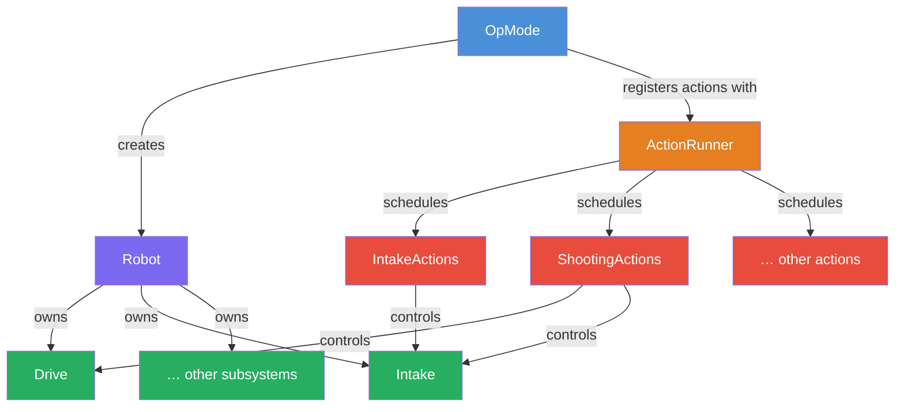
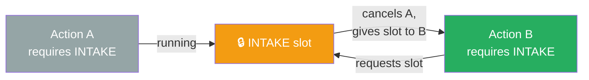
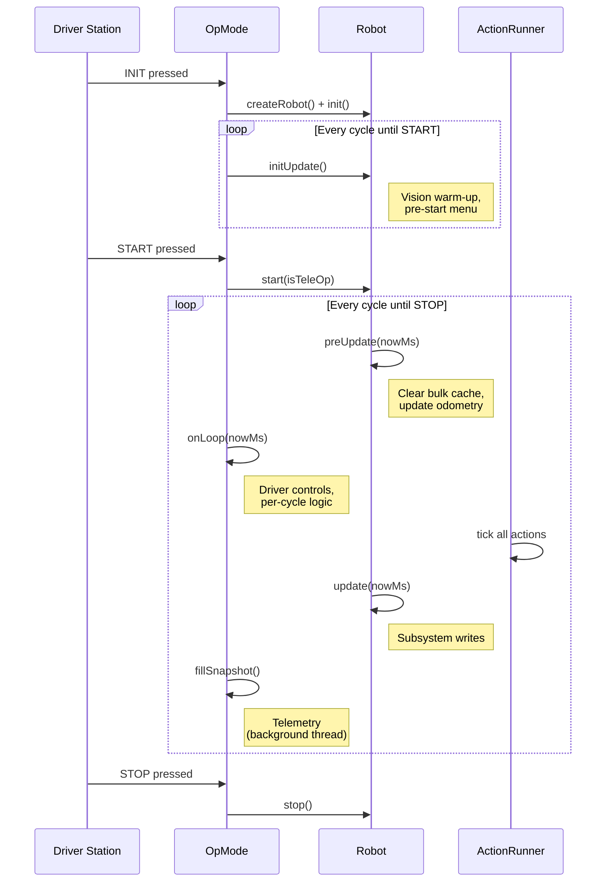
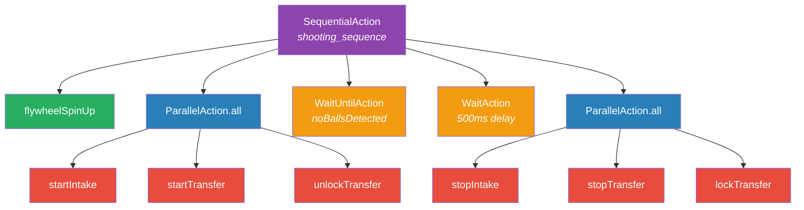

# Defined Quickstart

A getting-started template for FTC teams using the **Defined** action engine. This repository contains the essential classes and patterns you need to structure your robot code around subsystems, actions, and a clean lifecycle.

For the original library core, to understand in depth, how it works and what it’s doing, or contribute to it, please check:
https://github.com/cstahie/defined or https://github.com/cstahie/defined/tree/main/docs

---

## Table of Contents

- [What is Defined?](#what-is-defined)
- [Project Structure](#project-structure)
- [Architecture Overview](#architecture-overview)
- [Setup](#setup)
- [Core Concepts](#core-concepts)
  - [Config](#1-config)
  - [Subsystem Slots](#2-subsystem-slots)
  - [Subsystem Classes](#3-subsystem-classes)
  - [Robot](#4-robot)
  - [Actions](#5-actions)
  - [OpModes](#6-opmodes)
- [Robot Lifecycle](#robot-lifecycle)
- [Building Actions](#building-actions)
  - [One-Shot Actions](#one-shot-actions)
  - [Conditional Actions](#conditional-actions)
  - [Toggle Actions](#toggle-actions)
  - [While-Pressed Actions](#while-pressed-actions)
  - [Sequential Actions](#sequential-actions)
  - [Parallel Actions](#parallel-actions)
  - [Composing Complex Sequences](#composing-complex-sequences)
- [Built-in Utilities](#built-in-utilities)
  - [SectionProfiler](#sectionprofiler)
  - [SystemMonitor](#systemmonitor)
  - [HardwareScheduler](#hardwarescheduler)
  - [TelemetrySnapshot](#telemetrysnapshot)
  - [Pre-Start Menu](#pre-start-menu)
- [Step-by-Step: Adding a New Mechanism](#step-by-step-adding-a-new-mechanism)

---

## What is Defined?

Defined is a lightweight action-scheduling engine built for FTC. It gives you:

- **An action system** — composable units of work (one-shot, sequential, parallel, conditional) that can require exclusive access to subsystems.
- **A robot lifecycle** — structured hooks for init, start, loop, and stop phases so your code runs at the right time.
- **An action runner** — manages scheduling, cancellation, and slot-based conflict resolution so two actions never fight over the same motor.
- **Performance tools** — section profiling, system monitoring, I2C scheduling, and background-threaded telemetry out of the box.

---

## Project Structure

```
TeamCode/src/main/java/org/firstinspires/ftc/teamcode/
├── Robot.java                  # Central robot class — owns all subsystems
├── config/
│   └── Config.java             # Every tunable parameter in one place
├── subsystems/
│   ├── Subsystem.java          # Enum of subsystem slots (DRIVE, INTAKE, …)
│   ├── Drive.java              # Drivetrain hardware + control
│   └── Intake.java             # Intake hardware + control
├── actions/
│   ├── IntakeActions.java      # Actions that control the intake
│   ├── FlywheelActions.java    # Actions that control the flywheel
│   ├── TransferActions.java    # Actions that control the transfer
│   └── ShootingActions.java    # Complex multi-subsystem sequences
└── opmodes/
    └── MainTeleOp.java         # TeleOp OpMode
```

---

## Architecture Overview



---

## Setup

### 1. Add the repositories and dependencies

In your `TeamCode/build.gradle` or in `TeamCode/build.dependencies.gradle`, add the Defined Maven repository and dependencies:

```groovy
repositories {
    maven { url 'https://cstahie.github.io/defined' }
}
dependencies {
    implementation "com.teamundefined:defined-core:0.2.1"
    implementation "com.teamundefined:defined-ftc:0.2.1"     // optional FTC glue
    implementation "com.teamundefined:defined-pedro:0.2.1"   // optional Pedro actions
}
```

### 2. Sync Gradle

Sync your project in Android Studio. The Defined library will be downloaded and available for import.

### 3. Copy this quickstart

Clone or copy the files from this repository into your `TeamCode` module, then modify them to match your robot's hardware.

---

## Core Concepts

### 1. Config

**`config/Config.java`** is a single static class that holds every tunable parameter for your robot. Group parameters into inner classes by category.

```java
@Configurable
public class Config {
    public enum AllianceColor { RED, BLUE }
    public static AllianceColor ALLIANCE_COLOR = AllianceColor.RED;

    @Configurable
    public static class Intake {
        public static double IN_POWER = 1;
        public static double IDLE_POWER = 0;
        public static double OUT_POWER = -1;
    }

    @Configurable
    public static class Hardware {
        public static String INTAKE_MOTOR_NAME = "intake";
        public static String LB_DRIVE_MOTOR_NAME = "leftBack";
        // ... other hardware map names
    }
}
```

**Why a central Config?**

- Change any value in one place and it propagates everywhere.
- The `@Configurable` annotation exposes fields to the Panels dashboard for live tuning — no code upload needed.
- Hardware map names live here too, so if you rename a device in your configuration, you only change one string.

---

### 2. Subsystem Slots

**`subsystems/Subsystem.java`** is an enum that implements `Slot`. Each entry represents one logical subsystem of your robot.

```java
public enum Subsystem implements Slot {
    DRIVE, INTAKE
}
```

Slots are used by the action runner for **conflict resolution**. When an action declares `.requires(Subsystem.INTAKE)`, the runner knows that no other action requiring `INTAKE` can run at the same time. If a new action requests a slot that is already in use, the current action on that slot is cancelled.



Add one entry per subsystem on your robot: `DRIVE`, `INTAKE`, `OUTTAKE`, `TRANSFER`, `TURRET`, etc.

---

### 3. Subsystem Classes

A subsystem class wraps the hardware for one mechanism and provides control methods. It should handle **control logic** (power, PID, state machines) but **not** gamepad input.

Here is the included `Intake` subsystem:

```java
public class Intake {
    public DcMotorEx motor;
    double _power = 0;

    public Intake(HardwareMap hw) {
        this.motor = hw.get(DcMotorEx.class, Config.Hardware.INTAKE_MOTOR_NAME);
        this.motor.setMode(DcMotor.RunMode.STOP_AND_RESET_ENCODER);
        this.motor.setMode(DcMotor.RunMode.RUN_WITHOUT_ENCODER);
        this.motor.setZeroPowerBehavior(DcMotor.ZeroPowerBehavior.FLOAT);
    }

    public void start(boolean reversed) {
        _power = reversed ? Config.Intake.OUT_POWER : Config.Intake.IN_POWER;
    }

    public void stop() {
        _power = Config.Intake.IDLE_POWER;
    }

    public boolean isPowered() {
        return _power > 0.005;
    }

    public void update() {
        motor.setPower(_power);
    }
}
```

Key points:
- The constructor takes a `HardwareMap` and initializes hardware using names from `Config.Hardware`.
- Public methods (`start`, `stop`) change internal state.
- `update()` writes the state to hardware — called once per loop from `Robot.update()`.

---

### 4. Robot

**`Robot.java`** is the central class that owns every subsystem and controls the loop lifecycle. It extends `com.teamundefined.defined.ftc.Robot`.

```java
public class Robot extends com.teamundefined.defined.ftc.Robot {
    public Intake intake;
    public Drive drive;

    public Robot(HardwareMap hw) {
        intake = new Intake(hw);
        drive = new Drive(hw);
        // ... set up bulk caching, monitors, etc.
    }
}
```

The base class provides lifecycle hooks you override:

| Method | When it runs | Typical use |
|---|---|---|
| `init()` | Once after construction | Zero encoders, set initial modes |
| `initUpdate()` | Every cycle between INIT and START | Vision warm-up, servo holds |
| `start(boolean isTeleOp)` | Once when the match begins | Reset state, choose TeleOp vs Auto |
| `preUpdate(long nowMs)` | First half of every loop | Clear bulk cache, update odometry |
| `update(long nowMs)` | Second half of every loop | Run subsystem state machines, write to hardware |
| `setOpModeTime(double seconds)` | Every loop | Auto timing logic |
| `stop()` | On OpMode end or e-stop | Shutdown threads, zero power |

---

### 5. Actions

Actions are the heart of Defined. An **Action** is a unit of work that can be scheduled, composed, cancelled, and can declare which subsystem slots it needs.

Action classes live in the `actions/` package. Each file groups related actions for one mechanism as static factory methods:

```java
public class IntakeActions {
    public static Action startIntake(Robot r, boolean reversed) {
        return Action.oneShot("intake_start", now -> r.intake.start(reversed));
    }

    public static Action stopIntake(Robot r) {
        return Action.oneShot("intake_stop", now -> r.intake.stop());
    }
}
```

Every action has:
- A **name** (for debugging and logging).
- A **body** — the code that runs.
- Optional **slot requirements** — declared via `.requires(Subsystem.INTAKE)`.
- Optional **lifecycle callbacks** — `.withOnCancel()`, `.withOnComplete()`, `.withTimeout()`.

---

### 6. OpModes

OpModes extend `RobotOpMode<Robot>` and tie everything together.

```java
@TeleOp
public class MainTeleOp extends RobotOpMode<Robot> {
    @Override
    protected Robot createRobot() {
        return new Robot(hardwareMap);
    }

    @Override
    protected void onRobotInit() {
        robot = createRobot();

        // Register actions that react to gamepad input
        runner.addMonitor(IntakeActions.toggleIntake(robot, () -> gamepad1.squareWasReleased()));
    }

    @Override
    protected void onLoop(long nowMs) {
        // Per-cycle logic: drivetrain, sensors, etc.
        robot.drive.updateTeleOpInputs(
            -gamepad1.left_stick_y,
            gamepad1.left_stick_x,
            gamepad1.right_stick_x
        );
    }

    @Override
    protected void fillSnapshot(TelemetrySnapshot snapshot) {
        snapshot.put("Intake On", robot.intake.isPowered() ? "YES" : "NO");
    }
}
```

Key OpMode concepts:
- **`createRobot()`** — builds and returns your Robot instance.
- **`onRobotInit()`** — called once during INIT. Register monitors (actions that watch for gamepad input) and set up the pre-start menu here.
- **`onLoop(long nowMs)`** — called every cycle during the match. Put driver controls and per-cycle reads here.
- **`fillSnapshot(TelemetrySnapshot)`** — add telemetry data. Formatting happens on a background thread so it does not slow down your loop.
- **`runner`** — the `ActionRunner` instance. Use `runner.addMonitor()` for persistent input watchers and `runner.run()` for one-off actions.

---

## Robot Lifecycle



---

## Building Actions

Defined provides several action types that you compose together to build complex robot behaviors.

### One-Shot Actions

Run a single lambda once and complete immediately.

```java
Action.oneShot("intake_start", now -> robot.intake.start(false));
```

### Conditional Actions

Run every cycle **until** a condition is met.

```java
Action.until("wait_for_sensor", now -> {
    // runs every cycle
}, () -> robot.sensorTriggered());
```

The action completes when the supplier returns `true`. You can attach an `onCancel` callback for cleanup if the action is interrupted before the condition is met:

```java
Action.until("manual_intake_on", now -> robot.intake.start(false), () -> false)
    .requires(Subsystem.INTAKE)
    .withOnCancel(now -> robot.intake.stop());
```

### Toggle Actions

Alternate between two actions each time a button is pressed.

```java
ToggleAction.onPress(
    "intake_toggle",
    () -> gamepad1.squareWasReleased(),  // button supplier
    startIntake(robot, false),            // action on first press
    stopIntake(robot)                     // action on second press
);
```

Register this as a **monitor** — the runner checks it every cycle.

### While-Pressed Actions

Run an action while a button is held, then run a cleanup action on release. The constructor takes two **action suppliers** — one for the held state, one for release.

```java
new WhilePressedAction(
    "manual_intake",
    () -> gamepad1.right_trigger_pressed,  // held-down supplier
    runner,
    () -> startIntake(robot, false).requires(Subsystem.INTAKE),  // while held
    () -> stopIntake(robot).requires(Subsystem.INTAKE)            // on release
);
```

The suppliers return fresh action instances each press/release cycle. Chain `.requires()` on the inner actions to declare slot ownership — the runner will cancel any conflicting action on that slot when the button is pressed.

### Sequential Actions

Run actions one after another.

```java
new SequentialAction("my_sequence", List.of(
    actionA,
    actionB,
    actionC
));
```

### Parallel Actions

Run multiple actions at the same time. `ParallelAction.all()` completes when **all** child actions are done.

```java
ParallelAction.all("parallel_subsystems",
    IntakeActions.startIntake(robot, false),
    TransferActions.startTransfer(robot),
    TransferActions.unlockTransfer(robot)
);
```

### Composing Complex Sequences

Real robot behaviors combine all of these. Here is the included shooting sequence:

```java
public static Action shootingSequence(Robot r) {
    List<Action> actions = new ArrayList<>();

    // 1. Spin up the flywheel
    actions.add(FlywheelActions.flywheelSpinUp(r));

    // 2. Start intake + transfer simultaneously
    actions.add(ParallelAction.all("parallel_subsystems",
        IntakeActions.startIntake(r, false),
        TransferActions.startTransfer(r),
        TransferActions.unlockTransfer(r))
    );

    // 3. Wait for balls to exit (sensor or time-based)
    actions.add(WaitUntilAction.until("wait_for_balls_to_exit", r::noBallsDetected));
    actions.add(WaitAction.ms("wait_for_balls_to_exit", Config.Time.BALLS_EXIT_DELAY));

    // 4. Stop everything
    actions.add(ParallelAction.all("parallel_stop_subsystems",
        IntakeActions.stopIntake(r),
        TransferActions.stopTransfer(r),
        TransferActions.lockTransfer(r))
    );

    return new SequentialAction("shooting_sequence", actions)
        .withTimeout(Config.Time.SHOOTING_SEQUENCE_TIMEOUT)
        .withOnComplete(now -> Log.i("SHOOTING_SEQ", "Completed."))
        .requires(Subsystem.DRIVE, Subsystem.INTAKE);
}
```

This pattern — sequential steps containing parallel groups — is how you build most multi-subsystem behaviors:



Notice the `.requires(Subsystem.DRIVE, Subsystem.INTAKE)` at the end — this tells the runner that the entire sequence needs exclusive access to both slots. If another action tries to claim `INTAKE` while the shooting sequence is running, the sequence gets cancelled cleanly.

---

## Built-in Utilities

### SectionProfiler

Measures how long specific code sections take per cycle. Useful for finding performance bottlenecks.

```java
// In Robot.java
public enum Section { PRE_UPDATE, SUBSYSTEMS }
public final SectionProfiler<Section> profiler = new SectionProfiler<>(Config.Debug.PROFILER_ACTIVE);

// In preUpdate() or update()
profiler.start(Section.PRE_UPDATE);
// ... code to measure ...
profiler.start(Section.SUBSYSTEMS); // ends PRE_UPDATE, starts SUBSYSTEMS
```

Display results in telemetry:

```java
snapshot.put("Profiler", robot.profiler.getFormattedStats());
```

### SystemMonitor

Tracks cycle time, CPU usage, and other system-level metrics.

```java
public final SystemMonitor systemMonitor = new SystemMonitor(0.8); // smoothing factor

// In constructor
AndroidMetrics.addCpu(systemMonitor);
systemMonitor.addStandardMetrics();
systemMonitor.enabledWhen(() -> Config.Debug.SYSTEM_METRICS_ACTIVE);

// In preUpdate()
systemMonitor.update(nowMs);
```

### HardwareScheduler

Spreads I2C reads across multiple loops to prevent bus congestion. Instead of reading every sensor every cycle (which causes I2C spikes), the scheduler reads one sensor at a time on a configurable interval.

```java
public enum Read { INTAKE_CURRENT }
public final HardwareScheduler<Read> hardware = new HardwareScheduler<>();

// Register a scheduled read
hardware.register(
    Read.INTAKE_CURRENT,                              // key
    "intake_amps",                                    // display name
    Config.UpdateIntervals.INTAKE_CURRENT_UPDATE_INTERVAL, // ms between reads
    () -> Config.Power.INTAKE_AMPS = intake.motor.getCurrent(CurrentUnit.AMPS),
    Config.Debug.POWER_INFO_ACTIVE                    // enable/disable flag
);

// In preUpdate()
hardware.update(nowMs);
```

### TelemetrySnapshot

Telemetry data is formatted on a background thread so it does not affect loop performance. Override `fillSnapshot()` in your OpMode:

```java
@Override
protected void fillSnapshot(TelemetrySnapshot snapshot) {
    snapshot.put("Intake On", robot.intake.isPowered() ? "YES" : "NO");
    snapshot.putDouble("Intake amps", Config.Power.INTAKE_AMPS, 2);
    snapshot.put("System Metrics", robot.systemMonitor.getFormattedStats());
}
```

Control how often telemetry updates:

```java
@Override
protected int telemetryRefreshCycles() {
    return Config.Debug.TELEMETRY_UPDATE_CYCLES; // default is 20
}
```

### Pre-Start Menu

An interactive menu displayed while the robot is in INIT state. Lets you change configuration values (like alliance color or debug flags) without uploading new code.

```java
@Override
protected void onRobotInit() {
    robot = createRobot();
    enablePreStartMenu(
        Config.class,
        "Config.ALLIANCE_COLOR",
        "Debug.TELEMETRY_ACTIVE",
        "Debug.PROFILER_ACTIVE",
        "Debug.POWER_INFO_ACTIVE"
    );
}
```

Fields listed here become selectable on the Driver Station between INIT and START.

---

## Step-by-Step: Adding a New Mechanism

Let's walk through adding an "Outtake" mechanism with a servo and a motor.

### Step 1 — Add the subsystem slot

```java
// Subsystem.java
public enum Subsystem implements Slot {
    DRIVE, INTAKE, OUTTAKE  // <-- add OUTTAKE
}
```

### Step 2 — Add config values

```java
// Config.java
@Configurable
public static class Outtake {
    public static double SLIDE_POWER = 0.8;
    public static double BUCKET_DUMP_POS = 0.7;
    public static double BUCKET_HOME_POS = 0.1;
}

@Configurable
public static class Hardware {
    // ... existing entries ...
    public static String OUTTAKE_MOTOR_NAME = "outtakeSlide";
    public static String OUTTAKE_SERVO_NAME = "bucket";
}
```

### Step 3 — Create the subsystem class

```java
// subsystems/Outtake.java
public class Outtake {
    private final DcMotorEx slide;
    private final Servo bucket;

    public Outtake(HardwareMap hw) {
        slide = hw.get(DcMotorEx.class, Config.Hardware.OUTTAKE_MOTOR_NAME);
        bucket = hw.get(Servo.class, Config.Hardware.OUTTAKE_SERVO_NAME);
        slide.setZeroPowerBehavior(DcMotor.ZeroPowerBehavior.BRAKE);
    }

    public void extend()  { slide.setPower(Config.Outtake.SLIDE_POWER); }
    public void retract() { slide.setPower(-Config.Outtake.SLIDE_POWER); }
    public void holdSlide()   { slide.setPower(0); }
    public void dump()    { bucket.setPosition(Config.Outtake.BUCKET_DUMP_POS); }
    public void home()    { bucket.setPosition(Config.Outtake.BUCKET_HOME_POS); }
}
```

### Step 4 — Register it in Robot

```java
// Robot.java
public Outtake outtake;

public Robot(HardwareMap hw) {
    intake = new Intake(hw);
    drive = new Drive(hw);
    outtake = new Outtake(hw);  // <-- add this
    // ...
}
```

### Step 5 — Create actions

```java
// actions/OuttakeActions.java
public class OuttakeActions {
    public static Action extend(Robot r) {
        return Action.oneShot("outtake_extend", now -> r.outtake.extend())
            .requires(Subsystem.OUTTAKE);
    }

    public static Action retract(Robot r) {
        return Action.oneShot("outtake_retract", now -> r.outtake.retract())
            .requires(Subsystem.OUTTAKE);
    }

    public static Action dumpAndRetract(Robot r) {
        return new SequentialAction("dump_and_retract", List.of(
            Action.oneShot("dump", now -> r.outtake.dump()),
            WaitAction.ms("wait_for_dump", 500),
            Action.oneShot("home_bucket", now -> r.outtake.home()),
            Action.oneShot("retract", now -> r.outtake.retract())
        )).requires(Subsystem.OUTTAKE);
    }
}
```

### Step 6 — Wire it up in the OpMode

```java
// In onRobotInit()
runner.addMonitor(OuttakeActions.toggleDump(robot, () -> gamepad2.triangleWasReleased()));

// In fillSnapshot()
snapshot.put("Outtake", robot.outtake.isExtended() ? "EXTENDED" : "HOME");
```

The flow for any new mechanism always follows this pattern:


---

That's it. Clone this quickstart, replace the example subsystems with your own hardware, and start building actions. The pattern stays the same whether you have two mechanisms or twelve.
